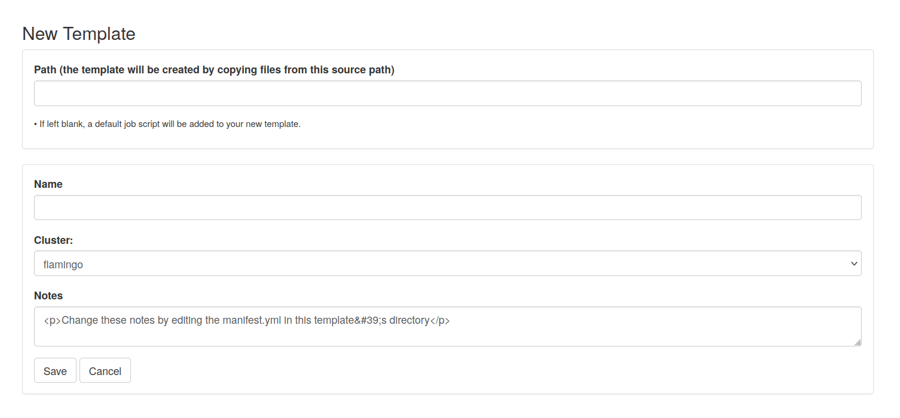
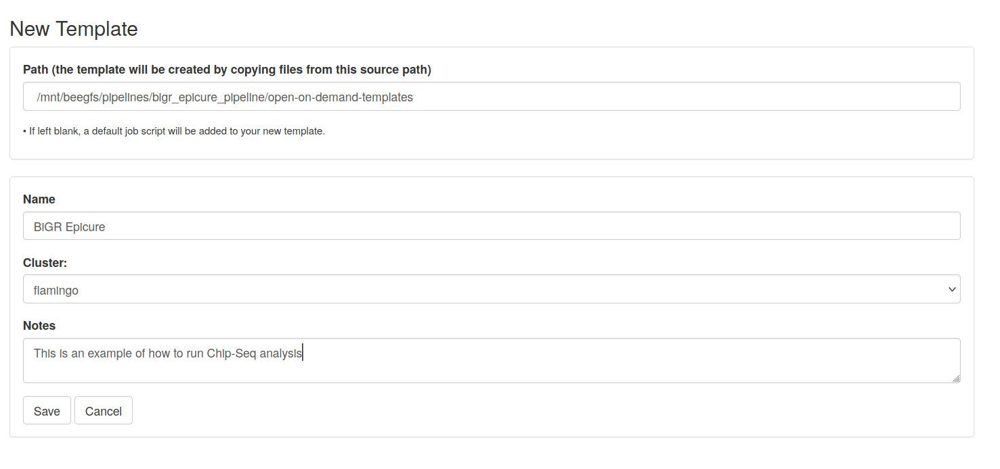
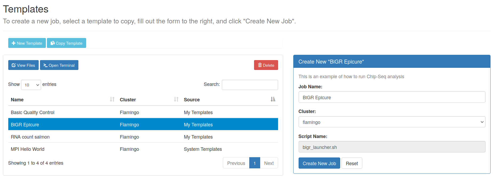
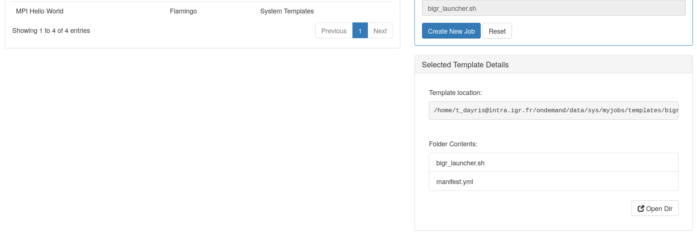
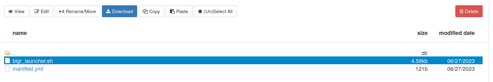
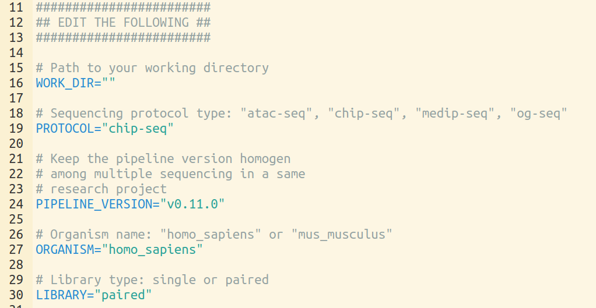
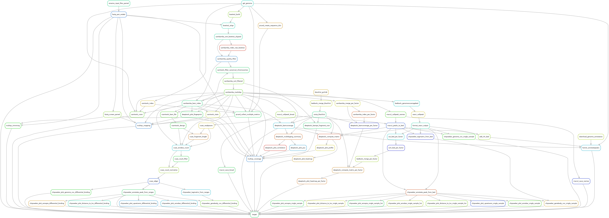
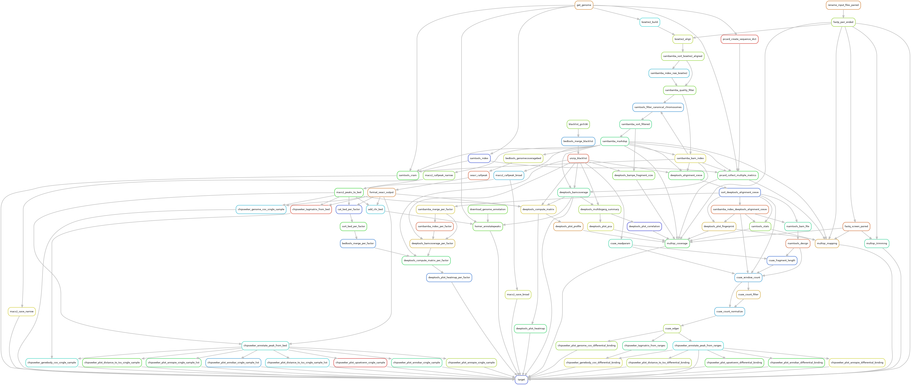
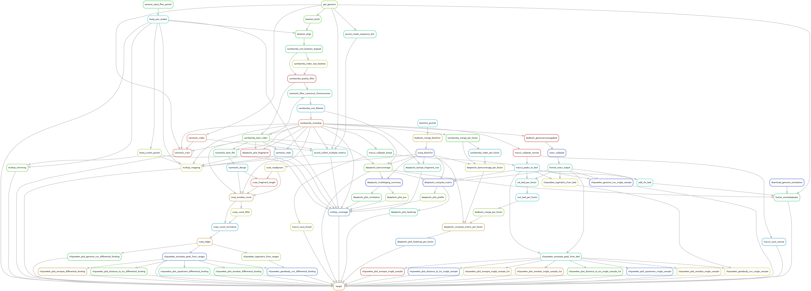
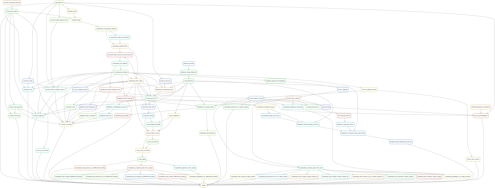

# bigr_epicure_pipeline
Snakemake pipeline for Epicure analyses: Chip-Seq, Atac-Seq, Cut&Tag, Cut&Run, MeDIP-Seq, 8-OxoG-Seq

# Summary

1. [CLI-Usage](https://github.com/tdayris/bigr_epicure_pipeline#usage)
    1. [Installation](https://github.com/tdayris/bigr_epicure_pipeline#installation-following-snakemake-workflows-guidelines)
    1. [Deployment](https://github.com/tdayris/bigr_epicure_pipeline#deployment-following-snakemake-workflows-guidelines)
    1. [Configuration](https://github.com/tdayris/bigr_epicure_pipeline#configure-workflow-following-snakemake-workflows-guidelines)
    1. [Run this workflow](https://github.com/tdayris/bigr_epicure_pipeline#run-workflow-following-snakemake-workflows-guidelines)
    1. [Report](https://github.com/tdayris/bigr_epicure_pipeline#generate-report-following-snakemake-workflows-guidelines)
1. [Open-On-Demand Flamingo](https://github.com/tdayris/bigr_epicure_pipeline#open-on-demand-flamingo)
    1. [Open-on-demand job composer](https://github.com/tdayris/bigr_epicure_pipeline#open-on-demand-job-composer)
    1. [Create a new template](https://github.com/tdayris/bigr_epicure_pipeline#create-a-new-template)
    1. [Edit the template with your current work](https://github.com/tdayris/bigr_epicure_pipeline#edit-the-template-with-your-current-work)
    1. [Edit `bigr_launcher.sh`](https://github.com/tdayris/bigr_epicure_pipeline#edit-bigr_launchersh)
    1. [Launch a new job](https://github.com/tdayris/bigr_epicure_pipeline#launch-a-new-job)
1. [Pipeline components](https://github.com/tdayris/bigr_epicure_pipeline#pipeline-description)
    1. [Preprocessing](https://github.com/tdayris/bigr_epicure_pipeline#pre-pocessing)
    1. [Read mapping](https://github.com/tdayris/bigr_epicure_pipeline#read-mapping)
    1. [Coverage](https://github.com/tdayris/bigr_epicure_pipeline#coverage)
    1. [Peak Calling](https://github.com/tdayris/bigr_epicure_pipeline#peak-calling)
    1. [Differential Peak Coverage](https://github.com/tdayris/bigr_epicure_pipeline#differential-peak-calling)
    1. [Peak annotation](https://github.com/tdayris/bigr_epicure_pipeline#peak-annotation)
    1. [Motifs](https://github.com/tdayris/bigr_epicure_pipeline#motifs)
1. [Material and methods](https://github.com/tdayris/bigr_epicure_pipeline#material-and-methods)
    1. [ChIP-Seq](https://github.com/tdayris/bigr_epicure_pipeline#chip-seq)
    1. [Atac-Seq](https://github.com/tdayris/bigr_epicure_pipeline#atac-seq)
    1. [Cut&Tag](https://github.com/tdayris/bigr_epicure_pipeline#cuttag)
    1. [Cut&Run](https://github.com/tdayris/bigr_epicure_pipeline#cutrun)
    1. [MeDIP-Seq](https://github.com/tdayris/bigr_epicure_pipeline#medip-seq)
    1. [OG-Seq](https://github.com/tdayris/bigr_epicure_pipeline#og-seq)
    1. [Gro-Seq](https://github.com/tdayris/bigr_epicure_pipeline#gro-seq)
    1. [Ribo-Seq](https://github.com/tdayris/bigr_epicure_pipeline#ribo-seq)
    1. [MNase-Seq](https://github.com/tdayris/bigr_epicure_pipeline#mnase-seq)
1. [Up-comming features](https://github.com/tdayris/bigr_epicure_pipeline#roadmap)

# Usage

## Installation (following Snakemake-Workflows guidelines)

_note: This action has already been done for you if you work at Gustave Roussy. See at the end of this section_

1. Install [snakemake](https://snakemake.readthedocs.io) and [snakedeploy](https://snakedeploy.readthedocs.io/en/latest/) with [mamba](https://github.com/mamba-org/mamba) package manager. Given that Mamba is installed, run:

`mamba create -c conda-forge -c bioconda --name bigr_epicure_pipeline snakemake snakedeploy pandas`

2. Ensure your conda environment is activated in your bash terminal:

`conda shell.bash activate bigr_epicure_pipeline`

Alternatively, if you work at Gustave Roussy, you can use our shared environment:

`conda shell.bash activate /mnt/beegfs/pipelines/unofficial-snakemake-wrappers/shared_conda/bigr_epicure_pipeline`

## Deployment (following Snakemake-Workflows guidelines)

_note: This action has been made easier for you if you work at Gustave Roussy. See at the end of this section_

Given that Snakemake and Snakedeploy are installed and available (see [Installation]()), the workflow can be deployed as follows.

1. Go to your working directory:

`cd path/to/my/project`

2. Deploy workflow:

`snakedeploy deploy-workflow https://github.com/tdayris/bigr_epicure_pipeline . --tag v0.4.0`

Snakedeploy will create two folders `workflow` and `config`. The former contains the deployment of the chosen workflow as a [Snakemake module](https://snakemake.readthedocs.io/en/stable/snakefiles/deployment.html#using-and-combining-pre-exising-workflows), the latter contains configuration files which will be modified in the next step in order to configure the workflow to your needs. Later, when executing the workflow, Snakemake will automatically find the main `Snakefile` in the `workflow` subfolder.

3. Consider to put the exact version of the pipeline and all modifications you might want perform under version control. _e.g._ by [managing it via a (private) Github repository](https://docs.github.com/en/github/importing-your-projects-to-github/adding-an-existing-project-to-github-using-the-command-line)

## Configure workflow (following Snakemake-Workflows guidelines)

See dedicated [`config/README.md`](https://github.com/tdayris/bigr_epicure_pipeline/blob/main/config/README.md) file for dedicated explanations of all options and consequences.

## Run workflow (following Snakemake-Workflows guidelines)

_note: This action has been made easier for you if you work at Gustave Roussy. See at the end of this section_

Given that the workflow has been properly deployed and configured, it can be executed as follows.

Fow running the workflow while deploying any necessary software via conda (using the Mamba package manager by default), run Snakemake with

`snakemake --cores all --use-conda `

Alternatively, for users at Gustave Roussy, you may use:

`bash workflow/scripts/misc/bigr_launcher.sh`

Snakemake will automatically detect the main `Snakefile` in the `workflow` subfolder and execute the workflow module that has been defined by the deployment in step 2.

For further options, e.g. for cluster and cloud execution, see [the docs](https://snakemake.readthedocs.io/).

## Generate report (following Snakemake-Workflows guidelines)

After finalizing your data analysis, you can automatically generate an interactive visual HTML report for inspection of results together with parameters and code inside of the browser via 

`snakemake --report report.zip`

The resulting `report.zip` file can be passed on to collaborators, provided as a supplementary file in publications, or uploaded to a service like [Zenodo](https://zenodo.org/) in order to obtain a citable [DOI](https://en.wikipedia.org/wiki/Digital_object_identifier). 

# Open-on-demand Flamingo

This section describes the pipeline usage through Open-on-demand web-interface at Flamingo, Gustave Roussy.

## Open-on-demand job composer

Log-in to Flamingo Open-On-Demand web-page using your institutional user name and password. On the main page, click on "Job", then, in the drop-down menu, hit "Job Composer"

## Create a new template

On the top of the new page, in the grey bar menu, hit "Template". Then use the light blue button "+ New Template".

An empty template for appears:

Fill the "Path" section with the following path: `/mnt/beegfs/pipelines/bigr_epicure_pipeline/open-on-demand-templates`. It is very important that you do not change this path. Fill the rest of the template as you like.

Hit the white "save" button at the bottom left of the form.

## Edit the template with your current work

Back to the "Template" page we saw earlier, a new line should be displayed with our new template. Click on the line and the right section of the page should display dedicated informations about this template.

Name it as you like, but **do not** create a job now! Scroll down and hit the white button: "Open Dir"

## Edit `bigr_launcher.sh`

Click on the file `bigr_launcher.sh` and hit the white button: "Edit".

Follow comments in grey and edit the line 11 to 30 as you'd like. You can refer to this page to know the latest version of this pipeline. You should always be using the latest version of this pipeline when starting a new project.

## Launch a new job

Back to the Job Composer window, you can now click "+ New Job", "From Template" and select the template we just made.

# Pipeline description

_note: The following steps may not be perform in that exact order._

## Pre-pocessing

| Step                                                                                                                                             | Tool             | Documentation                                                                                                                             | Reason                                                                                         |
| ------------------------------------------------------------------------------------------------------------------------------------------------ | ---------------- | ----------------------------------------------------------------------------------------------------------------------------------------- | ---------------------------------------------------------------------------------------------- |
| [Download genome sequence](https://github.com/tdayris/bigr_epicure_pipeline/blob/main/workflow/rules/reference/download_genome_sequence.smk)     | curl             | [Snakemake-Wrapper: download-sequence](https://snakemake-wrappers.readthedocs.io/en/v2.0.0/wrappers/reference/ensembl-sequence.html)     | Ensure genome sequence are consistent in Epicure analyses                                      |
| [Download genome annotation](https://github.com/tdayris/bigr_epicure_pipeline/blob/main/workflow/rules/reference/download_genome_annotation.smk) | curl             | [Snakemake-Wrapper: download-annotation](https://snakemake-wrappers.readthedocs.io/en/v2.0.0/wrappers/reference/ensembl-annotation.html) | Ensure genome annotation are consistent in Epicure analyses                                    |
| [Download blacklised regions](https://github.com/tdayris/bigr_epicure_pipeline/blob/main/workflow/rules/reference/download_blacklist.smk)        | [wget](https://anaconda.org/anaconda/wget) |                                                                                                                                           | Ensure blacklist regions are consistent in Epicure analyses                                    |
| [Trimming + QC](https://github.com/tdayris/bigr_epicure_pipeline/blob/main/workflow/rules/trimming/fastp.smk)                                    | Fastp            | [Snakemake-Wrapper: fastp](https://snakemake-wrappers.readthedocs.io/en/v2.0.0/wrappers/fastp.html)                                      | Perform read quality check and corrections, UMI, adapter removal, QC before and after trimming |
| [Quality Control](https://github.com/tdayris/bigr_epicure_pipeline/blob/main/workflow/rules/trimming/fastq_screen.smk)                           | FastqScreen      | [Snakemake-Wrapper: fastq-screen](https://snakemake-wrappers.readthedocs.io/en/v2.0.0/wrappers/fastq_screen.html)                        | Perform library quality check                                                                  |
| [Download fastq screen indexes](https://github.com/tdayris/bigr_epicure_pipeline/blob/main/workflow/rules/reference/download_fastq_screen_index.smk)                                                                                                                  | [wget](https://anaconda.org/anaconda/wget) |                                                                                                                                           | Ensure fastq_screen reports are the same among Epicure analyses |

## Read mapping

| Step                                                                                                                                       | Tool      | Documentation                                                                                                                                          | Reason                                                                                                                                                                                                                             |
| ------------------------------------------------------------------------------------------------------------------------------------------ | --------- | ------------------------------------------------------------------------------------------------------------------------------------------------------ | ---------------------------------------------------------------------------------------------------------------------------------------------------------------------------------------------------------------------------------- |
| [Indexation](https://github.com/tdayris/bigr_epicure_pipeline/blob/main/workflow/rules/indexing/bowtie2_index.smk)                         | Bowtie2   | [Snakemake-Wrapper: bowtie2-build](https://snakemake-wrappers.readthedocs.io/en/v2.0.0/wrappers/bowtie2/build.html)                                   | Index genome for up-coming read mapping                                                                                                                                                                                            |
| [Mapping](https://github.com/tdayris/bigr_epicure_pipeline/blob/main/workflow/rules/mapping/bowtie2_mapping.smk)                           | Bowtie2   | [Snakemake-Wrapper: bowtie2-align](https://snakemake-wrappers.readthedocs.io/en/v2.0.0/wrappers/bowtie2/align.html)                                   | Align sequenced reads on the genome                                                                                                                                                                                                |
| [Filtering](https://github.com/tdayris/bigr_epicure_pipeline/blob/main/workflow/rules/mapping/bowtie2_mapping.smk)                         | Sambamba  | [Snakemake-Wrapper: sambamba-sort](https://snakemake-wrappers.readthedocs.io/en/v2.0.0/wrappers/sambamba/sort.html)                                   | Sort alignment over chromosome position, this reduce up-coming required computing resources, and reduce alignment-file size.                                                                                                       |
| [Filtering](https://github.com/tdayris/bigr_epicure_pipeline/blob/main/workflow/rules/mapping/sambamba_samtools_filters.smk)               | Sambamba  | [Snakemake-Wrapper: sambamba-view](https://snakemake-wrappers.readthedocs.io/en/v2.0.0/wrappers/sambamba/view.html)                                   | Remove non-canonical chromosomes and mapping belonging to mitochondrial chromosome. Remove low quality mapping.                                                                                                                    |
| [Filtering](https://github.com/tdayris/bigr_epicure_pipeline/blob/main/workflow/rules/mapping/sambamba_markdup.smk)                        | Sambamba  | [Snakemake-Wrapper: sambamba-markdup](https://snakemake-wrappers.readthedocs.io/en/v2.0.0/wrappers/sambamba/markdup.html)                             | Remove sequencing duplicates.                                                                                                                                                                                                      |
| [Filtering](https://github.com/tdayris/bigr_epicure_pipeline/blob/main/workflow/rules/mapping/deeptools_shift.smk)                         | DeepTools | [Snakemake-Wrapper: sambamba-sort](https://snakemake-wrappers.readthedocs.io/en/v2.0.0/wrappers/deeptools/alignmentsieve.html)                        | For Atac-seq only. Reads on the positive strand should be shifted 4 bp to the right and reads on the negative strand should be shifted 5 bp to the left as in [Buenrostro et al. 2013](https://pubmed.ncbi.nlm.nih.gov/24097267/). |
| [Archive](https://github.com/tdayris/bigr_epicure_pipeline/blob/main/workflow/rules/mapping/samtools_cram.smk)                             | Sambamba  | [Snakemake-Wrapper: sambamba-view](https://snakemake-wrappers.readthedocs.io/en/v2.0.0/wrappers/sambamba/view.html)                                   | Compress alignment fil in CRAM format in order to reduce archive size.                                                                                                                                                             |
| [Quality Control](https://github.com/tdayris/bigr_epicure_pipeline/blob/main/workflow/rules/mapping_qc/picard_collect_mutiple_metrics.smk) | Picard    | [Snakemake-Wrapper: picard-collect-multiple-metrics](https://snakemake-wrappers.readthedocs.io/en/v2.0.0/wrappers/picard/collectmultiplemetrics.html) | Summarize alignments, GC bias, insert size metrics, and quality score distribution.                                                                                                                                                |
| [Quality Control](https://github.com/tdayris/bigr_epicure_pipeline/blob/main/workflow/rules/mapping_qc/samtools.smk)                       | Samtools  | [Snakemake-Wrapper: samtools-stats](https://snakemake-wrappers.readthedocs.io/en/v2.0.0/wrappers/samtools/stats.html)                                 | Summarize alignment metrics. Performed before and after mapping-post-processing in order to highlight possible bias.                                                                                                               |
| [Quality Control](https://github.com/tdayris/bigr_epicure_pipeline/blob/main/workflow/rules/mapping_qc/deeptools_fingerprint.smk)          | DeepTools | [Snakemake-Wrapper: deeptools-fingerprint](https://snakemake-wrappers.readthedocs.io/en/v2.0.0/wrappers/deeptools/plotfingerprint.html)               | Control signal specificity.                                                                                                                                                                                    |
| [GC-bias correction]()                                                                                                                     | DeepTools | [Official Documentation](https://deeptools.readthedocs.io/en/develop/content/tools/correctGCBias.html?highlight=correct%20gc%20bias)                   | Filter regions with abnormal GC-Bias as decribed in [Benjamini & Speed, 2012](https://pubmed.ncbi.nlm.nih.gov/22323520/). OxiDIP-Seq only. |

## Coverage

| Step                                                                                                                                                  | Tool      | Documentation                                                                                                                             | Reason                                                                                                                                                     |
| ----------------------------------------------------------------------------------------------------------------------------------------------------- | --------- | ----------------------------------------------------------------------------------------------------------------------------------------- | ---------------------------------------------------------------------------------------------------------------------------------------------------------- |
| [Coverage](https://github.com/tdayris/bigr_epicure_pipeline/blob/main/workflow/rules/coverage/deeptools_bamcoverage.smk)                              | DeepTools | [Snakemake-Wrapper: deeptools-bamcoverage](https://snakemake-wrappers.readthedocs.io/en/v2.0.0/wrappers/deeptools/bamcoverage.html)      | Compute genome coverage, normalized to 1M reads                                                                                                            |
| [Coverage](https://github.com/tdayris/bigr_epicure_pipeline/blob/main/workflow/rules/coverage/medips_meth.smk)                                        | MEDIPS    | [Official documentation](https://bioconductor.org/packages/release/bioc/vignettes/MEDIPS/inst/doc/MEDIPS.pdf)                             | Compute genome coverage with CpG density correction using MEDIPS (MeDIP-Seq only)                                                                          |
| [Scaled-Coverage](https://github.com/tdayris/bigr_epicure_pipeline/blob/main/workflow/rules/coverage/deeptools_matrix.smk)                            | DeepTools | [Snakemake-Wrapper: deeptools-computematrix](https://snakemake-wrappers.readthedocs.io/en/v2.0.0/wrappers/deeptools/computematrix.html)  | Calculate scores per genomic regions. Used for heatmaps and profile coverage plots.                                                                        |
| [Depth](https://github.com/tdayris/bigr_epicure_pipeline/blob/main/workflow/rules/coverage/deeptools_bamcoverage.smk)                                 | DeepTools | [Snakemake-Wrapper: deeptools-plotheatmap](https://snakemake-wrappers.readthedocs.io/en/v2.0.0/wrappers/deeptools/plotcoverage.html)     | Assess the sequencing depth of given samples                                                                                                               |
| [Coverage](https://github.com/tdayris/bigr_epicure_pipeline/blob/3aef8d1f83c3cd80c8553b35f5ce4cd8958b6d5d/workflow/rules/coverage/csaw_count.smk#L19) | CSAW      | [Official documentation](http://bioconductor.org/books/3.17/csawBook/counting-reads-into-windows.html)                                    | Count and filter reads over sliding windows.                                                                                                               |
| [Filter](https://github.com/tdayris/bigr_epicure_pipeline/blob/3aef8d1f83c3cd80c8553b35f5ce4cd8958b6d5d/workflow/rules/coverage/csaw_count.smk#L39)   | CSAW      | [Official documentation](http://bioconductor.org/books/3.17/csawBook/chap-filter.html)                                                    | Filter reads over background signal.                                                                                                                       |
| [Quality Control](https://github.com/tdayris/bigr_epicure_pipeline/blob/main/workflow/rules/coverage_qc/deeptools_plot_profile.smk)                   | DeepTools | [Snakemake-Wrapper: deeptools-plotprofile](https://snakemake-wrappers.readthedocs.io/en/v2.0.0/wrappers/deeptools/plotprofile.html)      | Plot profile scores over genomic regions                                                                                                                   |
| [Quality Control](https://github.com/tdayris/bigr_epicure_pipeline/blob/main/workflow/rules/coverage_qc/deeptools_plot_pca.smk)                       | DeepTools | [Official Documentation](https://deeptools.readthedocs.io/en/develop/content/tools/plotPCA.html?highlight=pca)                            | Plot [principal component analysis](https://en.wikipedia.org/wiki/Principal_component_analysis) (PCA) over bigwig coverage to assess sample dissimilarity. |
| [Quality Control](https://github.com/tdayris/bigr_epicure_pipeline/blob/main/workflow/rules/coverage_qc/deeptools_plot_correlation.smk)               | DeepTools | [Official Documentation](https://deeptools.readthedocs.io/en/develop/content/tools/plotCorrelation.html?highlight=plotcorrelation)        | Plot sample correlation based on the coverage analysis.                                                                                                    |
| [Coverage](https://github.com/tdayris/bigr_epicure_pipeline/blob/main/workflow/rules/peak-calling/seacr_callpeak.smk)                                                                                                                                          | BedTools  | [Snakemake-Wrapper: bedtools-genomecov](https://snakemake-wrappers.readthedocs.io/en/v2.0.0/wrappers/bedtools/genomecov.html) | Estimate raw coverage over the genome |

## Peak-Calling

| Step                                                                                                                       | Tool              | Documentation                                                                                                                        | Reason                                                                                                                            |
| -------------------------------------------------------------------------------------------------------------------------- | ----------------- | ------------------------------------------------------------------------------------------------------------------------------------ | --------------------------------------------------------------------------------------------------------------------------------- |
| [Peak-Calling](https://github.com/tdayris/bigr_epicure_pipeline/blob/main/workflow/rules/peak-calling/macs2_callpeak.smk)  | Mac2              | [Snakemake-Wrapper: macs2-callpeak](https://snakemake-wrappers.readthedocs.io/en/v2.0.0/wrappers/macs2/callpeak.html)               | Search for significant peaks                                                                                                      |
| [Heatmap](https://github.com/tdayris/bigr_epicure_pipeline/blob/main/workflow/rules/coverage/deeptools_plot_heatmap.smk)   | DeepTools         | [Snakemake-Wrapper: deeptools-plotheatmap](https://snakemake-wrappers.readthedocs.io/en/v2.0.0/wrappers/deeptools/plotheatmap.html) | Plot heatmap and peak coverage among samples                                                                                      |
| [FRiP score](https://github.com/tdayris/bigr_epicure_pipeline/blob/main/workflow/rules/peak-calling/manual_frip_score.smk) | Manually assessed |                                                                                                                                      | Compute [Fragment of Reads in Peaks](https://yiweiniu.github.io/blog/2019/03/Calculate-FRiP-score/) to assess signal/noise ratio. |
| [Peak-Calling](https://github.com/tdayris/bigr_epicure_pipeline/blob/main/workflow/rules/peak-calling/seacr_callpeak.smk)                                                                                                           | SEACR             | [Official Documentation](https://github.com/FredHutch/SEACR)                                                                                                           | Search for significant peaks in Cut&Tag or Cut&Run |

## Differential Peak Calling

| Step                                                                                                                                                               | Tool       | Documentation                                                                                                 | Reason                                                                        |
| ------------------------------------------------------------------------------------------------------------------------------------------------------------------ | ---------- | ------------------------------------------------------------------------------------------------------------- | ----------------------------------------------------------------------------- |
| [Peak-Calling](https://github.com/tdayris/bigr_epicure_pipeline/blob/main/workflow/rules/coverage/medips_meth.smk)                                                 | MEDIPS     | [Official documentation](https://bioconductor.org/packages/release/bioc/vignettes/MEDIPS/inst/doc/MEDIPS.pdf) | Search for significant variation in peak coverage with EdgeR (MeDIP-Seq only) |
| [Normalization](https://github.com/tdayris/bigr_epicure_pipeline/blob/3aef8d1f83c3cd80c8553b35f5ce4cd8958b6d5d/workflow/rules/differential_binding/csaw_db.smk#L1) | CSAW       | [Official documentation](http://bioconductor.org/books/3.17/csawBook/chap-norm.html)                          | Correct composition bias and variable library sizes.                          |
| [Differential Binding](https://github.com/tdayris/bigr_epicure_pipeline/blob/3aef8d1f83c3cd80c8553b35f5ce4cd8958b6d5d/workflow/rules/differential_binding/csaw_db.smk#L23)                                                                                                                                           | CSAW-EdgeR | [Official documentation](http://bioconductor.org/books/3.17/csawBook/chap-stats.html)                                                                                    | Call for differentially covered windows |

## Peak annotation

| Step                                                                                                                                                                            | Tool        | Documentation                                                                                                                                                                    | Reason                                                           |
| ------------------------------------------------------------------------------------------------------------------------------------------------------------------------------- | ----------- | -------------------------------------------------------------------------------------------------------------------------------------------------------------------------------- | ---------------------------------------------------------------- |
| Annotation                                                                                                                                                                      | MEDIPS      | [Official Documentation](https://bioconductor.org/packages/release/bioc/vignettes/MEDIPS/inst/doc/MEDIPS.pdf)                                                                    | Annotate peaks with Ensembl-mart through MEDIPS (MeDIP-Seq only) |
| [Annotation](https://github.com/tdayris/bigr_epicure_pipeline/blob/main/workflow/rules/annotation/homer_annotate_peaks.smk)                                                     | Homer       | [Snakemake-Wrapper: homer-annotatepeaks](https://snakemake-wrappers.readthedocs.io/en/stable/wrappers/homer/annotatePeaks.html)                                                  | Performing peak annotation to associate peaks with nearby genes. |
| [Annotation](https://github.com/tdayris/bigr_epicure_pipeline/blob/main/workflow/rules/annotation/chipseeker_peak_annotate.smk)                                                 | CHiP seeker | [Official Documentation](https://bioconductor.org/packages/release/bioc/vignettes/ChIPseeker/inst/doc/ChIPseeker.html#peak-annotation)                                           | Performing peak annotation to associate peaks with nearby genes. |
| [Quality Control](https://github.com/tdayris/bigr_epicure_pipeline/blob/5d281b42b1c1e4b2fdc09a72c89fc185e81eb449/workflow/rules/annotation/chipseeker_plot_annobar.smk)         | CHiP Seeker | [Official Documentation](https://bioconductor.org/packages/release/bioc/vignettes/ChIPseeker/inst/doc/ChIPseeker.html#visualize-genomic-annotation)                              | Perform region-wise barplot graph.                               |
| [Quality Control](https://github.com/tdayris/bigr_epicure_pipeline/blob/5d281b42b1c1e4b2fdc09a72c89fc185e81eb449/workflow/rules/annotation/chipseeker_plot_upsetvenn.smk)       | CHiP Seeker | [Official Documentation](https://bioconductor.org/packages/release/bioc/vignettes/ChIPseeker/inst/doc/ChIPseeker.html#visualize-genomic-annotation)                              | Perform region-wise upset-plot.                                  |
| [Quality Control](https://github.com/tdayris/bigr_epicure_pipeline/blob/5d281b42b1c1e4b2fdc09a72c89fc185e81eb449/workflow/rules/annotation/chipseeker_plot_distance_to_tss.smk) | CHiP Seeker | [Official Documentation](https://bioconductor.org/packages/release/bioc/vignettes/ChIPseeker/inst/doc/ChIPseeker.html#visualize-distribution-of-tf-binding-loci-relative-to-tss) | Visualize distribution of TF-binding loci relative to TSS        |

## Motifs

| Step                                                                                                                                                        | Tool  | Documentation                                                             | Reason                              |
| ----------------------------------------------------------------------------------------------------------------------------------------------------------- | ----- | ------------------------------------------------------------------------- | ----------------------------------- |
| [De-novo](https://github.com/tdayris/bigr_epicure_pipeline/blob/5d281b42b1c1e4b2fdc09a72c89fc185e81eb449/workflow/rules/motif/homer_find_motifs_genome.smk) | Homer | [Official Documentation](http://homer.ucsd.edu/homer/ngs/peakMotifs.html) | Perform _de novo_ motifs discovery. |

# Material and Methods

## ChIP-Seq

Reads are trimmed using [fastp](https://github.com/OpenGene/fastp) version [0.23.2](https://snakemake-wrappers.readthedocs.io/en/v2.0.0/wrappers/fastp.html#software-dependencies), using default parameters. Trimmed reads are mapped over the genome of interest defined in the configuration file, using [bowtie2](http://bowtie-bio.sourceforge.net/bowtie2/manual.shtml) version [2.5.1](https://snakemake-wrappers.readthedocs.io/en/v2.0.0/wrappers/bowtie2/align.html#software-dependencies), using `--very-sensitive` parameter to increase mapping specificity.

Mapped reads with a quality lower than 30 are dropped out using [Sambamba](https://lomereiter.github.io/sambamba/docs/sambamba-view.html) version [1.0](https://snakemake-wrappers.readthedocs.io/en/v2.0.0/wrappers/sambamba/view.html#software-dependencies) with parameter `--filter 'mapping_quality >= 30'`. In case of pair-ended library, orphan reads a dropped out using `--filter 'not (unmapped or mate_is_unmapped)'` in [Sambamba](https://lomereiter.github.io/sambamba/docs/sambamba-view.html) version [1.0](https://snakemake-wrappers.readthedocs.io/en/v2.0.0/wrappers/sambamba/view.html#software-dependencies). Remaining reads are filtered over canonical chromosomes, using [Samtools](http://www.htslib.org/doc/samtools-stats.html) version [1.17](https://snakemake-wrappers.readthedocs.io/en/v2.0.0/wrappers/samtools/stats.html#software-dependencies). Mitochondrial chromosome is not considered as a canonical chromosome, that being so, mitochondrial reads are dropped out. In case regions of interest are defined over the genome, [BedTools](https://bedtools.readthedocs.io/en/latest/content/tools/intersect.html) version [2.31.0](https://snakemake-wrappers.readthedocs.io/en/v2.0.0/wrappers/bedtools/intersect.html#software-dependencies) with `-wa -sorted` as optional parameter to keep mapped reads that overlap the regions of interest by, at least, one base. Duplicated reads were filtered out, using [Sambamba](https://lomereiter.github.io/sambamba/docs/sambamba-view.html) version [1.0](https://snakemake-wrappers.readthedocs.io/en/v2.0.0/wrappers/sambamba/view.html#software-dependencies) using the optional parameter `--remove-duplicates --overflow-list-size 600000`.

A quality control is made _both before and after_ these filters to ensure no valuable data is lost. These quality controls are made using [Picard](https://broadinstitute.github.io/picard/command-line-overview.html#CollectMultipleMetrics) version [3.0.0](https://snakemake-wrappers.readthedocs.io/en/v2.0.0/wrappers/picard/collectmultiplemetrics.html#software-dependencies), and [Samtools](http://www.htslib.org/doc/samtools-stats.html) version [1.17](https://snakemake-wrappers.readthedocs.io/en/v2.0.0/wrappers/samtools/stats.html#software-dependencies).

Genome coverage was assessed with [DeepTools](https://deeptools.readthedocs.io/en/develop/content/tools/bamCoverage.html?highlight=bamcoverage) version [3.5.2](https://deeptools.readthedocs.io/en/develop/content/tools/bamCoverage.html?highlight=bamcoverage). Chromosome X and Y were ignored in the RPKM normalization in order to reduce noise the final result. using the following optional parameters ` --normalizeUsing RPKM --binSize 5 --skipNonCoveredRegions --ignoreForNormalization chrX chrM chrY`. The same tool was used to plot both quality controls and peak coverage heatmaps.

Single-sample peak calling was performed by [Macs2](https://snakemake-wrappers.readthedocs.io/en/stable/wrappers/macs2/callpeak.html) version [2.2.7.1](https://snakemake-wrappers.readthedocs.io/en/stable/wrappers/macs2/callpeak.html#software-dependencies) using both broad and narrow options. Pair-ended libraries recieved the `--format BAMPE` parameters, while single-ended libraries used estimated fragment size provided in input.

The peak annotation was done using [ChIPSeeker](https://bioconductor.org/packages/release/bioc/vignettes/ChIPseeker/inst/doc/ChIPseeker.html#peak-annotation) version [1.34.0](https://github.com/tdayris/bigr_epicure_pipeline/blob/main/workflow/envs/chipseeker.yaml), using [Org.eg.db](https://bioconductor.org/packages/3.16/data/annotation/html/org.Hs.eg.db.html) annotations version [3.16.0](https://github.com/tdayris/bigr_epicure_pipeline/blob/main/workflow/envs/chipseeker.yaml).

_De novo_ motif discovery was made with [Homer](http://homer.ucsd.edu/homer/ngs/peakMotifs.html) version [4.11](https://snakemake-wrappers.readthedocs.io/en/stable/wrappers/homer/annotatePeaks.html#software-dependencies) over called peaks, using the following optional parameters `-size 200 -homer2` over the genome identified in the configuration file (GRCh38 or mm10). The motifs were used for further annotation of peaks with Homer.

Differential binding analysis was performed using [CSAW](https://bioconductor.org/books/release/csawBook/index.html) version [1.32.0](https://github.com/tdayris/bigr_epicure_pipeline/blob/5d45c659d26196701cce7be91ed61260e6cebcec/workflow/envs/csaw.yaml#L6). Input signal (if available) was used to find signal of interest over background noise. Or else, a large binning was defined over mappable genome regions to define a background noise track to use as an input signal. In any case, a log2 of 1.1 between the background and the sample of interest was used as a threshold value to identify regions of interest. Data were normalized over efficiency biases as described in [CSAW documentation](https://bioconductor.org/books/release/csawBook/chap-norm.html#sec:eff-norm), since libraries of the same size can still have composition bias. Differential binded sites were called using EdgeR over the statistical formulas described in the configuration file. The `prior N` was defined over 20 degrees of freedom in the GLM test. FDR values from EdgeR were corrected using a region merge accross gene annotations to account for related binding sites. Differentially bounded regions were annotated as if they were peaks, using the same methods, and the same parameters.

Additional quality controls were made using [FastqScreen](https://snakemake-wrappers.readthedocs.io/en/v2.0.0/wrappers/fastq_screen.html) version [0.15.3](https://snakemake-wrappers.readthedocs.io/en/v2.0.0/wrappers/fastq_screen.html#software-dependencies). Complete quality reports were built using [MultiQC](https://snakemake-wrappers.readthedocs.io/en/stable/wrappers/multiqc.html) aggregation tool and in-house scripts.

The whole pipeline was powered by [Snakemake](https://snakemake.readthedocs.io/) version [7.26.0](https://snakemake.readthedocs.io/en/stable/project_info/history.html#id14) and the [Snakemake-Wrappers](https://snakemake-wrappers.readthedocs.io/en/v2.0.0/index.html) version [v2.0.0](https://github.com/snakemake/snakemake-wrappers).

## MNase-seq

Reads are trimmed using [fastp](https://github.com/OpenGene/fastp) version [0.23.2](https://snakemake-wrappers.readthedocs.io/en/v2.0.0/wrappers/fastp.html#software-dependencies), using default parameters. Trimmed reads are mapped over the genome of interest defined in the configuration file, using [bowtie2](http://bowtie-bio.sourceforge.net/bowtie2/manual.shtml) version [2.5.1](https://snakemake-wrappers.readthedocs.io/en/v2.0.0/wrappers/bowtie2/align.html#software-dependencies), using `--very-sensitive` parameter to increase mapping specificity.

Mapped reads with a quality lower than 30 are dropped out using [Sambamba](https://lomereiter.github.io/sambamba/docs/sambamba-view.html) version [1.0](https://snakemake-wrappers.readthedocs.io/en/v2.0.0/wrappers/sambamba/view.html#software-dependencies) with parameter `--filter 'mapping_quality >= 30'`. In case of pair-ended library, orphan reads a dropped out using `--filter 'not (unmapped or mate_is_unmapped)'` in [Sambamba](https://lomereiter.github.io/sambamba/docs/sambamba-view.html) version [1.0](https://snakemake-wrappers.readthedocs.io/en/v2.0.0/wrappers/sambamba/view.html#software-dependencies). Remaining reads are filtered over canonical chromosomes, using [Samtools](http://www.htslib.org/doc/samtools-stats.html) version [1.17](https://snakemake-wrappers.readthedocs.io/en/v2.0.0/wrappers/samtools/stats.html#software-dependencies). Mitochondrial chromosome is not considered as a canonical chromosome, that being so, mitochondrial reads are dropped out. In case regions of interest are defined over the genome, [BedTools](https://bedtools.readthedocs.io/en/latest/content/tools/intersect.html) version [2.31.0](https://snakemake-wrappers.readthedocs.io/en/v2.0.0/wrappers/bedtools/intersect.html#software-dependencies) with `-wa -sorted` as optional parameter to keep mapped reads that overlap the regions of interest by, at least, one base. Duplicated reads were filtered out, using [Sambamba](https://lomereiter.github.io/sambamba/docs/sambamba-view.html) version [1.0](https://snakemake-wrappers.readthedocs.io/en/v2.0.0/wrappers/sambamba/view.html#software-dependencies) using the optional parameter `--remove-duplicates --overflow-list-size 600000`.

A quality control is made _both before and after_ these filters to ensure no valuable data is lost. These quality controls are made using [Picard](https://broadinstitute.github.io/picard/command-line-overview.html#CollectMultipleMetrics) version [3.0.0](https://snakemake-wrappers.readthedocs.io/en/v2.0.0/wrappers/picard/collectmultiplemetrics.html#software-dependencies), and [Samtools](http://www.htslib.org/doc/samtools-stats.html) version [1.17](https://snakemake-wrappers.readthedocs.io/en/v2.0.0/wrappers/samtools/stats.html#software-dependencies).

Genome coverage was assessed with [DeepTools](https://deeptools.readthedocs.io/en/develop/content/tools/bamCoverage.html?highlight=bamcoverage) version [3.5.2](https://deeptools.readthedocs.io/en/develop/content/tools/bamCoverage.html?highlight=bamcoverage). Chromosome X and Y were ignored in the RPKM normalization in order to reduce noise the final result. MNase specificity was also taken into account using the following optional parameters ` --normalizeUsing RPKM --binSize 5 --skipNonCoveredRegions --ignoreForNormalization chrX chrM chrY --MNase`. The same tool was used to plot both quality controls and peak coverage heatmaps.

Single-sample peak calling was performed by [Macs2](https://snakemake-wrappers.readthedocs.io/en/stable/wrappers/macs2/callpeak.html) version [2.2.7.1](https://snakemake-wrappers.readthedocs.io/en/stable/wrappers/macs2/callpeak.html#software-dependencies) using both broad and narrow options. Pair-ended libraries recieved the `--format BAMPE` parameters, while single-ended libraries used estimated fragment size provided in input.

The peak annotation was done using [ChIPSeeker](https://bioconductor.org/packages/release/bioc/vignettes/ChIPseeker/inst/doc/ChIPseeker.html#peak-annotation) version [1.34.0](https://github.com/tdayris/bigr_epicure_pipeline/blob/main/workflow/envs/chipseeker.yaml), using [Org.eg.db](https://bioconductor.org/packages/3.16/data/annotation/html/org.Hs.eg.db.html) annotations version [3.16.0](https://github.com/tdayris/bigr_epicure_pipeline/blob/main/workflow/envs/chipseeker.yaml).

_De novo_ motif discovery was made with [Homer](http://homer.ucsd.edu/homer/ngs/peakMotifs.html) version [4.11](https://snakemake-wrappers.readthedocs.io/en/stable/wrappers/homer/annotatePeaks.html#software-dependencies) over called peaks, using the following optional parameters `-size 200 -homer2` over the genome identified in the configuration file (GRCh38 or mm10). The motifs were used for further annotation of peaks with Homer.

Differential binding analysis was performed using [CSAW](https://bioconductor.org/books/release/csawBook/index.html) version [1.32.0](https://github.com/tdayris/bigr_epicure_pipeline/blob/5d45c659d26196701cce7be91ed61260e6cebcec/workflow/envs/csaw.yaml#L6). Input signal (if available) was used to find signal of interest over background noise. Or else, a large binning was defined over mappable genome regions to define a background noise track to use as an input signal. In any case, a log2 of 1.1 between the background and the sample of interest was used as a threshold value to identify regions of interest. Data were normalized over efficiency biases as described in [CSAW documentation](https://bioconductor.org/books/release/csawBook/chap-norm.html#sec:eff-norm), since libraries of the same size can still have composition bias. Differential binded sites were called using EdgeR over the statistical formulas described in the configuration file. The `prior N` was defined over 20 degrees of freedom in the GLM test. FDR values from EdgeR were corrected using a region merge accross gene annotations to account for related binding sites. Differentially bounded regions were annotated as if they were peaks, using the same methods, and the same parameters.

Additional quality controls were made using [FastqScreen](https://snakemake-wrappers.readthedocs.io/en/v2.0.0/wrappers/fastq_screen.html) version [0.15.3](https://snakemake-wrappers.readthedocs.io/en/v2.0.0/wrappers/fastq_screen.html#software-dependencies). Complete quality reports were built using [MultiQC](https://snakemake-wrappers.readthedocs.io/en/stable/wrappers/multiqc.html) aggregation tool and in-house scripts.

The whole pipeline was powered by [Snakemake](https://snakemake.readthedocs.io/) version [7.26.0](https://snakemake.readthedocs.io/en/stable/project_info/history.html#id14) and the [Snakemake-Wrappers](https://snakemake-wrappers.readthedocs.io/en/v2.0.0/index.html) version [v2.0.0](https://github.com/snakemake/snakemake-wrappers).

## Gro-seq

Reads are trimmed using [fastp](https://github.com/OpenGene/fastp) version [0.23.2](https://snakemake-wrappers.readthedocs.io/en/v2.0.0/wrappers/fastp.html#software-dependencies), using default parameters. Trimmed reads are mapped over the genome of interest defined in the configuration file, using [bowtie2](http://bowtie-bio.sourceforge.net/bowtie2/manual.shtml) version [2.5.1](https://snakemake-wrappers.readthedocs.io/en/v2.0.0/wrappers/bowtie2/align.html#software-dependencies), using `--very-sensitive` parameter to increase mapping specificity.

Mapped reads with a quality lower than 30 are dropped out using [Sambamba](https://lomereiter.github.io/sambamba/docs/sambamba-view.html) version [1.0](https://snakemake-wrappers.readthedocs.io/en/v2.0.0/wrappers/sambamba/view.html#software-dependencies) with parameter `--filter 'mapping_quality >= 30'`. In case of pair-ended library, orphan reads a dropped out using `--filter 'not (unmapped or mate_is_unmapped)'` in [Sambamba](https://lomereiter.github.io/sambamba/docs/sambamba-view.html) version [1.0](https://snakemake-wrappers.readthedocs.io/en/v2.0.0/wrappers/sambamba/view.html#software-dependencies). Remaining reads are filtered over canonical chromosomes, using [Samtools](http://www.htslib.org/doc/samtools-stats.html) version [1.17](https://snakemake-wrappers.readthedocs.io/en/v2.0.0/wrappers/samtools/stats.html#software-dependencies). Mitochondrial chromosome is not considered as a canonical chromosome, that being so, mitochondrial reads are dropped out. In case regions of interest are defined over the genome, [BedTools](https://bedtools.readthedocs.io/en/latest/content/tools/intersect.html) version [2.31.0](https://snakemake-wrappers.readthedocs.io/en/v2.0.0/wrappers/bedtools/intersect.html#software-dependencies) with `-wa -sorted` as optional parameter to keep mapped reads that overlap the regions of interest by, at least, one base. Duplicated reads were filtered out, using [Sambamba](https://lomereiter.github.io/sambamba/docs/sambamba-view.html) version [1.0](https://snakemake-wrappers.readthedocs.io/en/v2.0.0/wrappers/sambamba/view.html#software-dependencies) using the optional parameter `--remove-duplicates --overflow-list-size 600000`.

A quality control is made _both before and after_ these filters to ensure no valuable data is lost. These quality controls are made using [Picard](https://broadinstitute.github.io/picard/command-line-overview.html#CollectMultipleMetrics) version [3.0.0](https://snakemake-wrappers.readthedocs.io/en/v2.0.0/wrappers/picard/collectmultiplemetrics.html#software-dependencies), and [Samtools](http://www.htslib.org/doc/samtools-stats.html) version [1.17](https://snakemake-wrappers.readthedocs.io/en/v2.0.0/wrappers/samtools/stats.html#software-dependencies).

Genome coverage was assessed with [DeepTools](https://deeptools.readthedocs.io/en/develop/content/tools/bamCoverage.html?highlight=bamcoverage) version [3.5.2](https://deeptools.readthedocs.io/en/develop/content/tools/bamCoverage.html?highlight=bamcoverage). Chromosome X and Y were ignored in the RPKM normalization in order to reduce noise the final result. Gro-seq specificity was also taken into account using the following optional parameters ` --normalizeUsing RPKM --binSize 5 --skipNonCoveredRegions --ignoreForNormalization chrX chrM chrY --Offset 12`. The same tool was used to plot both quality controls and peak coverage heatmaps.

Single-sample peak calling was performed by [Macs2](https://snakemake-wrappers.readthedocs.io/en/stable/wrappers/macs2/callpeak.html) version [2.2.7.1](https://snakemake-wrappers.readthedocs.io/en/stable/wrappers/macs2/callpeak.html#software-dependencies) using both broad and narrow options. Pair-ended libraries recieved the `--format BAMPE` parameters, while single-ended libraries used estimated fragment size provided in input.

The peak annotation was done using [ChIPSeeker](https://bioconductor.org/packages/release/bioc/vignettes/ChIPseeker/inst/doc/ChIPseeker.html#peak-annotation) version [1.34.0](https://github.com/tdayris/bigr_epicure_pipeline/blob/main/workflow/envs/chipseeker.yaml), using [Org.eg.db](https://bioconductor.org/packages/3.16/data/annotation/html/org.Hs.eg.db.html) annotations version [3.16.0](https://github.com/tdayris/bigr_epicure_pipeline/blob/main/workflow/envs/chipseeker.yaml).

_De novo_ motif discovery was made with [Homer](http://homer.ucsd.edu/homer/ngs/peakMotifs.html) version [4.11](https://snakemake-wrappers.readthedocs.io/en/stable/wrappers/homer/annotatePeaks.html#software-dependencies) over called peaks, using the following optional parameters `-size 200 -homer2` over the genome identified in the configuration file (GRCh38 or mm10). The motifs were used for further annotation of peaks with Homer.

Differential binding analysis was performed using [CSAW](https://bioconductor.org/books/release/csawBook/index.html) version [1.32.0](https://github.com/tdayris/bigr_epicure_pipeline/blob/5d45c659d26196701cce7be91ed61260e6cebcec/workflow/envs/csaw.yaml#L6). Input signal (if available) was used to find signal of interest over background noise. Or else, a large binning was defined over mappable genome regions to define a background noise track to use as an input signal. In any case, a log2 of 1.1 between the background and the sample of interest was used as a threshold value to identify regions of interest. Data were normalized over efficiency biases as described in [CSAW documentation](https://bioconductor.org/books/release/csawBook/chap-norm.html#sec:eff-norm), since libraries of the same size can still have composition bias. Differential binded sites were called using EdgeR over the statistical formulas described in the configuration file. The `prior N` was defined over 20 degrees of freedom in the GLM test. FDR values from EdgeR were corrected using a region merge accross gene annotations to account for related binding sites. Differentially bounded regions were annotated as if they were peaks, using the same methods, and the same parameters.

Additional quality controls were made using [FastqScreen](https://snakemake-wrappers.readthedocs.io/en/v2.0.0/wrappers/fastq_screen.html) version [0.15.3](https://snakemake-wrappers.readthedocs.io/en/v2.0.0/wrappers/fastq_screen.html#software-dependencies). Complete quality reports were built using [MultiQC](https://snakemake-wrappers.readthedocs.io/en/stable/wrappers/multiqc.html) aggregation tool and in-house scripts.

The whole pipeline was powered by [Snakemake](https://snakemake.readthedocs.io/) version [7.26.0](https://snakemake.readthedocs.io/en/stable/project_info/history.html#id14) and the [Snakemake-Wrappers](https://snakemake-wrappers.readthedocs.io/en/v2.0.0/index.html) version [v2.0.0](https://github.com/snakemake/snakemake-wrappers).

## Ribo-seq

Reads are trimmed using [fastp](https://github.com/OpenGene/fastp) version [0.23.2](https://snakemake-wrappers.readthedocs.io/en/v2.0.0/wrappers/fastp.html#software-dependencies), using default parameters. Trimmed reads are mapped over the genome of interest defined in the configuration file, using [bowtie2](http://bowtie-bio.sourceforge.net/bowtie2/manual.shtml) version [2.5.1](https://snakemake-wrappers.readthedocs.io/en/v2.0.0/wrappers/bowtie2/align.html#software-dependencies), using `--very-sensitive` parameter to increase mapping specificity.

Mapped reads with a quality lower than 30 are dropped out using [Sambamba](https://lomereiter.github.io/sambamba/docs/sambamba-view.html) version [1.0](https://snakemake-wrappers.readthedocs.io/en/v2.0.0/wrappers/sambamba/view.html#software-dependencies) with parameter `--filter 'mapping_quality >= 30'`. In case of pair-ended library, orphan reads a dropped out using `--filter 'not (unmapped or mate_is_unmapped)'` in [Sambamba](https://lomereiter.github.io/sambamba/docs/sambamba-view.html) version [1.0](https://snakemake-wrappers.readthedocs.io/en/v2.0.0/wrappers/sambamba/view.html#software-dependencies). Remaining reads are filtered over canonical chromosomes, using [Samtools](http://www.htslib.org/doc/samtools-stats.html) version [1.17](https://snakemake-wrappers.readthedocs.io/en/v2.0.0/wrappers/samtools/stats.html#software-dependencies). Mitochondrial chromosome is not considered as a canonical chromosome, that being so, mitochondrial reads are dropped out. In case regions of interest are defined over the genome, [BedTools](https://bedtools.readthedocs.io/en/latest/content/tools/intersect.html) version [2.31.0](https://snakemake-wrappers.readthedocs.io/en/v2.0.0/wrappers/bedtools/intersect.html#software-dependencies) with `-wa -sorted` as optional parameter to keep mapped reads that overlap the regions of interest by, at least, one base. Duplicated reads were filtered out, using [Sambamba](https://lomereiter.github.io/sambamba/docs/sambamba-view.html) version [1.0](https://snakemake-wrappers.readthedocs.io/en/v2.0.0/wrappers/sambamba/view.html#software-dependencies) using the optional parameter `--remove-duplicates --overflow-list-size 600000`.

A quality control is made _both before and after_ these filters to ensure no valuable data is lost. These quality controls are made using [Picard](https://broadinstitute.github.io/picard/command-line-overview.html#CollectMultipleMetrics) version [3.0.0](https://snakemake-wrappers.readthedocs.io/en/v2.0.0/wrappers/picard/collectmultiplemetrics.html#software-dependencies), and [Samtools](http://www.htslib.org/doc/samtools-stats.html) version [1.17](https://snakemake-wrappers.readthedocs.io/en/v2.0.0/wrappers/samtools/stats.html#software-dependencies).

Genome coverage was assessed with [DeepTools](https://deeptools.readthedocs.io/en/develop/content/tools/bamCoverage.html?highlight=bamcoverage) version [3.5.2](https://deeptools.readthedocs.io/en/develop/content/tools/bamCoverage.html?highlight=bamcoverage). Chromosome X and Y were ignored in the RPKM normalization in order to reduce noise the final result. Ribo-seq specificity was also taken into account using the following optional parameters ` --normalizeUsing RPKM --binSize 5 --skipNonCoveredRegions --ignoreForNormalization chrX chrM chrY --Offset 15`. The same tool was used to plot both quality controls and peak coverage heatmaps.

Single-sample peak calling was performed by [Macs2](https://snakemake-wrappers.readthedocs.io/en/stable/wrappers/macs2/callpeak.html) version [2.2.7.1](https://snakemake-wrappers.readthedocs.io/en/stable/wrappers/macs2/callpeak.html#software-dependencies) using both broad and narrow options. Pair-ended libraries recieved the `--format BAMPE` parameters, while single-ended libraries used estimated fragment size provided in input.

The peak annotation was done using [ChIPSeeker](https://bioconductor.org/packages/release/bioc/vignettes/ChIPseeker/inst/doc/ChIPseeker.html#peak-annotation) version [1.34.0](https://github.com/tdayris/bigr_epicure_pipeline/blob/main/workflow/envs/chipseeker.yaml), using [Org.eg.db](https://bioconductor.org/packages/3.16/data/annotation/html/org.Hs.eg.db.html) annotations version [3.16.0](https://github.com/tdayris/bigr_epicure_pipeline/blob/main/workflow/envs/chipseeker.yaml).

_De novo_ motif discovery was made with [Homer](http://homer.ucsd.edu/homer/ngs/peakMotifs.html) version [4.11](https://snakemake-wrappers.readthedocs.io/en/stable/wrappers/homer/annotatePeaks.html#software-dependencies) over called peaks, using the following optional parameters `-size 200 -homer2` over the genome identified in the configuration file (GRCh38 or mm10). The motifs were used for further annotation of peaks with Homer.

Differential binding analysis was performed using [CSAW](https://bioconductor.org/books/release/csawBook/index.html) version [1.32.0](https://github.com/tdayris/bigr_epicure_pipeline/blob/5d45c659d26196701cce7be91ed61260e6cebcec/workflow/envs/csaw.yaml#L6). Input signal (if available) was used to find signal of interest over background noise. Or else, a large binning was defined over mappable genome regions to define a background noise track to use as an input signal. In any case, a log2 of 1.1 between the background and the sample of interest was used as a threshold value to identify regions of interest. Data were normalized over efficiency biases as described in [CSAW documentation](https://bioconductor.org/books/release/csawBook/chap-norm.html#sec:eff-norm), since libraries of the same size can still have composition bias. Differential binded sites were called using EdgeR over the statistical formulas described in the configuration file. The `prior N` was defined over 20 degrees of freedom in the GLM test. FDR values from EdgeR were corrected using a region merge accross gene annotations to account for related binding sites. Differentially bounded regions were annotated as if they were peaks, using the same methods, and the same parameters.

Additional quality controls were made using [FastqScreen](https://snakemake-wrappers.readthedocs.io/en/v2.0.0/wrappers/fastq_screen.html) version [0.15.3](https://snakemake-wrappers.readthedocs.io/en/v2.0.0/wrappers/fastq_screen.html#software-dependencies). Complete quality reports were built using [MultiQC](https://snakemake-wrappers.readthedocs.io/en/stable/wrappers/multiqc.html) aggregation tool and in-house scripts.

The whole pipeline was powered by [Snakemake](https://snakemake.readthedocs.io/) version [7.26.0](https://snakemake.readthedocs.io/en/stable/project_info/history.html#id14) and the [Snakemake-Wrappers](https://snakemake-wrappers.readthedocs.io/en/v2.0.0/index.html) version [v2.0.0](https://github.com/snakemake/snakemake-wrappers).

## Atac-seq

Reads are trimmed using [fastp](https://github.com/OpenGene/fastp) version [0.23.2](https://snakemake-wrappers.readthedocs.io/en/v2.0.0/wrappers/fastp.html#software-dependencies), using default parameters. Trimmed reads are mapped over the genome of interest defined in the configuration file, using [bowtie2](http://bowtie-bio.sourceforge.net/bowtie2/manual.shtml) version [2.5.1](https://snakemake-wrappers.readthedocs.io/en/v2.0.0/wrappers/bowtie2/align.html#software-dependencies), using `--very-sensitive` parameter to increase mapping specificity.

Mapped reads with a quality lower than 30 are dropped out using [Sambamba](https://lomereiter.github.io/sambamba/docs/sambamba-view.html) version [1.0](https://snakemake-wrappers.readthedocs.io/en/v2.0.0/wrappers/sambamba/view.html#software-dependencies) with parameter `--filter 'mapping_quality >= 30'`. In case of pair-ended library, orphan reads a dropped out using `--filter 'not (unmapped or mate_is_unmapped)'` in [Sambamba](https://lomereiter.github.io/sambamba/docs/sambamba-view.html) version [1.0](https://snakemake-wrappers.readthedocs.io/en/v2.0.0/wrappers/sambamba/view.html#software-dependencies). Remaining reads are filtered over canonical chromosomes, using [Samtools](http://www.htslib.org/doc/samtools-stats.html) version [1.17](https://snakemake-wrappers.readthedocs.io/en/v2.0.0/wrappers/samtools/stats.html#software-dependencies). Mitochondrial chromosome is not considered as a canonical chromosome, that being so, mitochondrial reads are dropped out. In case regions of interest are defined over the genome, [BedTools](https://bedtools.readthedocs.io/en/latest/content/tools/intersect.html) version [2.31.0](https://snakemake-wrappers.readthedocs.io/en/v2.0.0/wrappers/bedtools/intersect.html#software-dependencies) with `-wa -sorted` as optional parameter to keep mapped reads that overlap the regions of interest by, at least, one base. Duplicated reads were filtered out, using [Sambamba](https://lomereiter.github.io/sambamba/docs/sambamba-view.html) version [1.0](https://snakemake-wrappers.readthedocs.io/en/v2.0.0/wrappers/sambamba/view.html#software-dependencies) using the optional parameter `--remove-duplicates --overflow-list-size 600000`. Remaining reads were shifted as described in Buenrostro et al. 2013 : reads on the positive strand were shifted 4 bp to the right and reads on the negative were be shifted 5 bp to the left using [DeepTools](https://deeptools.readthedocs.io/en/develop/content/tools/alignmentSieve.html) version [3.5.2](https://deeptools.readthedocs.io/en/develop/content/tools/alignmentSieve.html) and the optional parameter `--ATACShift`.

A quality control is made _both before and after_ these filters to ensure no valuable data is lost. These quality controls are made using [Picard](https://broadinstitute.github.io/picard/command-line-overview.html#CollectMultipleMetrics) version [3.0.0](https://snakemake-wrappers.readthedocs.io/en/v2.0.0/wrappers/picard/collectmultiplemetrics.html#software-dependencies), and [Samtools](http://www.htslib.org/doc/samtools-stats.html) version [1.17](https://snakemake-wrappers.readthedocs.io/en/v2.0.0/wrappers/samtools/stats.html#software-dependencies).

Genome coverage was assessed with [DeepTools](https://deeptools.readthedocs.io/en/develop/content/tools/bamCoverage.html?highlight=bamcoverage) version [3.5.2](https://deeptools.readthedocs.io/en/develop/content/tools/bamCoverage.html?highlight=bamcoverage). Chromosome X and Y were ignored in the RPKM normalization in order to reduce noise the final result. using the following optional parameters ` --normalizeUsing RPKM --binSize 5 --skipNonCoveredRegions --ignoreForNormalization chrX chrM chrY`. The same tool was used to plot both quality controls and peak coverage heatmaps.

Single-sample peak calling was performed by [Macs2](https://snakemake-wrappers.readthedocs.io/en/stable/wrappers/macs2/callpeak.html) version [2.2.7.1](https://snakemake-wrappers.readthedocs.io/en/stable/wrappers/macs2/callpeak.html#software-dependencies) using both broad and narrow options. Pair-ended libraries recieved the `--format BAMPE` parameters, while single-ended libraries used estimated fragment size provided in input.

The peak annotation was done using [ChIPSeeker](https://bioconductor.org/packages/release/bioc/vignettes/ChIPseeker/inst/doc/ChIPseeker.html#peak-annotation) version [1.34.0](https://github.com/tdayris/bigr_epicure_pipeline/blob/main/workflow/envs/chipseeker.yaml), using [Org.eg.db](https://bioconductor.org/packages/3.16/data/annotation/html/org.Hs.eg.db.html) annotations version [3.16.0](https://github.com/tdayris/bigr_epicure_pipeline/blob/main/workflow/envs/chipseeker.yaml).

_De novo_ motif discovery was made with [Homer](http://homer.ucsd.edu/homer/ngs/peakMotifs.html) version [4.11](https://snakemake-wrappers.readthedocs.io/en/stable/wrappers/homer/annotatePeaks.html#software-dependencies) over called peaks, using the following optional parameters `-size 200 -homer2` over the genome identified in the configuration file (GRCh38 or mm10). The motifs were used for further annotation of peaks with Homer.

Differential binding analysis was performed using [CSAW](https://bioconductor.org/books/release/csawBook/index.html) version [1.32.0](https://github.com/tdayris/bigr_epicure_pipeline/blob/5d45c659d26196701cce7be91ed61260e6cebcec/workflow/envs/csaw.yaml#L6). A large binning was defined over mappable genome regions to define a background noise track to use as an input signal. In any case, a log2 of 1.1 between the background and the sample of interest was used as a threshold value to identify regions of interest. Data were normalized over efficiency biases as described in [CSAW documentation](https://bioconductor.org/books/release/csawBook/chap-norm.html#sec:eff-norm), since libraries of the same size can still have composition bias. Differential binded sites were called using EdgeR over the statistical formulas described in the configuration file. The `prior N` was defined over 20 degrees of freedom in the GLM test. FDR values from EdgeR were corrected using a region merge accross gene annotations to account for related binding sites. Differentially bounded regions were annotated as if they were peaks, using the same methods, and the same parameters.

Additional quality controls were made using [FastqScreen](https://snakemake-wrappers.readthedocs.io/en/v2.0.0/wrappers/fastq_screen.html) version [0.15.3](https://snakemake-wrappers.readthedocs.io/en/v2.0.0/wrappers/fastq_screen.html#software-dependencies). Complete quality reports were built using [MultiQC](https://snakemake-wrappers.readthedocs.io/en/stable/wrappers/multiqc.html) aggregation tool and in-house scripts.

The whole pipeline was powered by [Snakemake](https://snakemake.readthedocs.io/) version [7.26.0](https://snakemake.readthedocs.io/en/stable/project_info/history.html#id14) and the [Snakemake-Wrappers](https://snakemake-wrappers.readthedocs.io/en/v2.0.0/index.html) version [v2.0.0](https://github.com/snakemake/snakemake-wrappers).

## Cut&Tag

Reads are trimmed using [fastp](https://github.com/OpenGene/fastp) version [0.23.2](https://snakemake-wrappers.readthedocs.io/en/v2.0.0/wrappers/fastp.html#software-dependencies), using default parameters. Trimmed reads are mapped over the genome of interest defined in the configuration file, using [bowtie2](http://bowtie-bio.sourceforge.net/bowtie2/manual.shtml) version [2.5.1](https://snakemake-wrappers.readthedocs.io/en/v2.0.0/wrappers/bowtie2/align.html#software-dependencies), using `--very-sensitive` parameter to increase mapping specificity.

Mapped reads with a quality lower than 30 are dropped out using [Sambamba](https://lomereiter.github.io/sambamba/docs/sambamba-view.html) version [1.0](https://snakemake-wrappers.readthedocs.io/en/v2.0.0/wrappers/sambamba/view.html#software-dependencies) with parameter `--filter 'mapping_quality >= 30'`. In case of pair-ended library, orphan reads a dropped out using `--filter 'not (unmapped or mate_is_unmapped)'` in [Sambamba](https://lomereiter.github.io/sambamba/docs/sambamba-view.html) version [1.0](https://snakemake-wrappers.readthedocs.io/en/v2.0.0/wrappers/sambamba/view.html#software-dependencies). Remaining reads are filtered over canonical chromosomes, using [Samtools](http://www.htslib.org/doc/samtools-stats.html) version [1.17](https://snakemake-wrappers.readthedocs.io/en/v2.0.0/wrappers/samtools/stats.html#software-dependencies). Mitochondrial chromosome is not considered as a canonical chromosome, that being so, mitochondrial reads are dropped out. In case regions of interest are defined over the genome, [BedTools](https://bedtools.readthedocs.io/en/latest/content/tools/intersect.html) version [2.31.0](https://snakemake-wrappers.readthedocs.io/en/v2.0.0/wrappers/bedtools/intersect.html#software-dependencies) with `-wa -sorted` as optional parameter to keep mapped reads that overlap the regions of interest by, at least, one base. Duplicated reads were *not* filtered out, but marked as duplicates, using [Sambamba](https://lomereiter.github.io/sambamba/docs/sambamba-view.html) version [1.0](https://snakemake-wrappers.readthedocs.io/en/v2.0.0/wrappers/sambamba/view.html#software-dependencies) using the optional parameter `--overflow-list-size 600000`.

A quality control is made _both before and after_ these filters to ensure no valuable data is lost. These quality controls are made using [Picard](https://broadinstitute.github.io/picard/command-line-overview.html#CollectMultipleMetrics) version [3.0.0](https://snakemake-wrappers.readthedocs.io/en/v2.0.0/wrappers/picard/collectmultiplemetrics.html#software-dependencies), and [Samtools](http://www.htslib.org/doc/samtools-stats.html) version [1.17](https://snakemake-wrappers.readthedocs.io/en/v2.0.0/wrappers/samtools/stats.html#software-dependencies).

Genome coverage was assessed with [DeepTools](https://deeptools.readthedocs.io/en/develop/content/tools/bamCoverage.html?highlight=bamcoverage) version [3.5.2](https://deeptools.readthedocs.io/en/develop/content/tools/bamCoverage.html?highlight=bamcoverage). Chromosome X and Y were ignored in the RPKM normalization in order to reduce noise the final result. using the following optional parameters ` --normalizeUsing RPKM --binSize 5 --skipNonCoveredRegions --ignoreForNormalization chrX chrM chrY --ignoreDuplicates`. Reads marked as duplicates were treated as normal reads. The same tool was used to plot both quality controls and peak coverage heatmaps.

Single-sample peak calling was performed by [Macs2](https://snakemake-wrappers.readthedocs.io/en/stable/wrappers/macs2/callpeak.html) version [2.2.7.1](https://snakemake-wrappers.readthedocs.io/en/stable/wrappers/macs2/callpeak.html#software-dependencies) using both broad and narrow options. Pair-ended libraries recieved the `--format BAMPE` parameters, while single-ended libraries used estimated fragment size provided in input. Alongside with Macs2, [SEACR](https://github.com/FredHutch/SEACR/blob/master/SEACR_1.3.R) version [1.3](https://github.com/tdayris/bigr_epicure_pipeline/blob/f7a783b6857ea3c74811f1003bc5091c6267d907/workflow/envs/seacr.yaml#L6) was used to perform single-sample peak-calling using parameters hinted in the original publication of SEACR.

The peak annotation was done using [ChIPSeeker](https://bioconductor.org/packages/release/bioc/vignettes/ChIPseeker/inst/doc/ChIPseeker.html#peak-annotation) version [1.34.0](https://github.com/tdayris/bigr_epicure_pipeline/blob/main/workflow/envs/chipseeker.yaml), using [Org.eg.db](https://bioconductor.org/packages/3.16/data/annotation/html/org.Hs.eg.db.html) annotations version [3.16.0](https://github.com/tdayris/bigr_epicure_pipeline/blob/main/workflow/envs/chipseeker.yaml).

_De novo_ motif discovery was made with [Homer](http://homer.ucsd.edu/homer/ngs/peakMotifs.html) version [4.11](https://snakemake-wrappers.readthedocs.io/en/stable/wrappers/homer/annotatePeaks.html#software-dependencies) over called peaks, using the following optional parameters `-size 200 -homer2` over the genome identified in the configuration file (GRCh38 or mm10). The motifs were used for further annotation of peaks with Homer.

Differential binding analysis was performed using [CSAW](https://bioconductor.org/books/release/csawBook/index.html) version [1.32.0](https://github.com/tdayris/bigr_epicure_pipeline/blob/5d45c659d26196701cce7be91ed61260e6cebcec/workflow/envs/csaw.yaml#L6). Input signal (if available) was used to find signal of interest over background noise. Or else, a large binning was defined over mappable genome regions to define a background noise track to use as an input signal. In any case, a log2 of 1.1 between the background and the sample of interest was used as a threshold value to identify regions of interest. Data were normalized over efficiency biases as described in [CSAW documentation](https://bioconductor.org/books/release/csawBook/chap-norm.html#sec:eff-norm), since libraries of the same size can still have composition bias. Differential binded sites were called using EdgeR over the statistical formulas described in the configuration file. The `prior N` was defined over 20 degrees of freedom in the GLM test. FDR values from EdgeR were corrected using a region merge accross gene annotations to account for related binding sites. Through the whole process, reads flagged as duplicates are treated as any other read. Differentially bounded regions were annotated as if they were peaks, using the same methods, and the same parameters.

Additional quality controls were made using [FastqScreen](https://snakemake-wrappers.readthedocs.io/en/v2.0.0/wrappers/fastq_screen.html) version [0.15.3](https://snakemake-wrappers.readthedocs.io/en/v2.0.0/wrappers/fastq_screen.html#software-dependencies). Complete quality reports were built using [MultiQC](https://snakemake-wrappers.readthedocs.io/en/stable/wrappers/multiqc.html) aggregation tool and in-house scripts.

The whole pipeline was powered by [Snakemake](https://snakemake.readthedocs.io/) version [7.26.0](https://snakemake.readthedocs.io/en/stable/project_info/history.html#id14) and the [Snakemake-Wrappers](https://snakemake-wrappers.readthedocs.io/en/v2.0.0/index.html) version [v2.0.0](https://github.com/snakemake/snakemake-wrappers).

## Cut&Run

Reads are trimmed using [fastp](https://github.com/OpenGene/fastp) version [0.23.2](https://snakemake-wrappers.readthedocs.io/en/v2.0.0/wrappers/fastp.html#software-dependencies), using default parameters. Trimmed reads are mapped over the genome of interest defined in the configuration file, using [bowtie2](http://bowtie-bio.sourceforge.net/bowtie2/manual.shtml) version [2.5.1](https://snakemake-wrappers.readthedocs.io/en/v2.0.0/wrappers/bowtie2/align.html#software-dependencies), using `--very-sensitive` parameter to increase mapping specificity.

Mapped reads with a quality lower than 30 are dropped out using [Sambamba](https://lomereiter.github.io/sambamba/docs/sambamba-view.html) version [1.0](https://snakemake-wrappers.readthedocs.io/en/v2.0.0/wrappers/sambamba/view.html#software-dependencies) with parameter `--filter 'mapping_quality >= 30'`. In case of pair-ended library, orphan reads a dropped out using `--filter 'not (unmapped or mate_is_unmapped)'` in [Sambamba](https://lomereiter.github.io/sambamba/docs/sambamba-view.html) version [1.0](https://snakemake-wrappers.readthedocs.io/en/v2.0.0/wrappers/sambamba/view.html#software-dependencies). Remaining reads are filtered over canonical chromosomes, using [Samtools](http://www.htslib.org/doc/samtools-stats.html) version [1.17](https://snakemake-wrappers.readthedocs.io/en/v2.0.0/wrappers/samtools/stats.html#software-dependencies). Mitochondrial chromosome is not considered as a canonical chromosome, that being so, mitochondrial reads are dropped out. In case regions of interest are defined over the genome, [BedTools](https://bedtools.readthedocs.io/en/latest/content/tools/intersect.html) version [2.31.0](https://snakemake-wrappers.readthedocs.io/en/v2.0.0/wrappers/bedtools/intersect.html#software-dependencies) with `-wa -sorted` as optional parameter to keep mapped reads that overlap the regions of interest by, at least, one base. Duplicated reads were *not* filtered out, but marked as duplicates, using [Sambamba](https://lomereiter.github.io/sambamba/docs/sambamba-view.html) version [1.0](https://snakemake-wrappers.readthedocs.io/en/v2.0.0/wrappers/sambamba/view.html#software-dependencies) using the optional parameter `--overflow-list-size 600000`.

A quality control is made _both before and after_ these filters to ensure no valuable data is lost. These quality controls are made using [Picard](https://broadinstitute.github.io/picard/command-line-overview.html#CollectMultipleMetrics) version [3.0.0](https://snakemake-wrappers.readthedocs.io/en/v2.0.0/wrappers/picard/collectmultiplemetrics.html#software-dependencies), and [Samtools](http://www.htslib.org/doc/samtools-stats.html) version [1.17](https://snakemake-wrappers.readthedocs.io/en/v2.0.0/wrappers/samtools/stats.html#software-dependencies).

Genome coverage was assessed with [DeepTools](https://deeptools.readthedocs.io/en/develop/content/tools/bamCoverage.html?highlight=bamcoverage) version [3.5.2](https://deeptools.readthedocs.io/en/develop/content/tools/bamCoverage.html?highlight=bamcoverage). Chromosome X and Y were ignored in the RPKM normalization in order to reduce noise the final result. using the following optional parameters ` --normalizeUsing RPKM --binSize 5 --skipNonCoveredRegions --ignoreForNormalization chrX chrM chrY --ignoreDuplicates`. Reads marked as duplicates were treated as normal reads. The same tool was used to plot both quality controls and peak coverage heatmaps.

Single-sample peak calling was performed by [Macs2](https://snakemake-wrappers.readthedocs.io/en/stable/wrappers/macs2/callpeak.html) version [2.2.7.1](https://snakemake-wrappers.readthedocs.io/en/stable/wrappers/macs2/callpeak.html#software-dependencies) using both broad and narrow options. Pair-ended libraries recieved the `--format BAMPE` parameters, while single-ended libraries used estimated fragment size provided in input.Alongside with Macs2, [SEACR](https://github.com/FredHutch/SEACR/blob/master/SEACR_1.3.R) version [1.3](https://github.com/tdayris/bigr_epicure_pipeline/blob/f7a783b6857ea3c74811f1003bc5091c6267d907/workflow/envs/seacr.yaml#L6) was used to perform single-sample peak-calling using parameters hinted in the original publication of SEACR.

The peak annotation was done using [ChIPSeeker](https://bioconductor.org/packages/release/bioc/vignettes/ChIPseeker/inst/doc/ChIPseeker.html#peak-annotation) version [1.34.0](https://github.com/tdayris/bigr_epicure_pipeline/blob/main/workflow/envs/chipseeker.yaml), using [Org.eg.db](https://bioconductor.org/packages/3.16/data/annotation/html/org.Hs.eg.db.html) annotations version [3.16.0](https://github.com/tdayris/bigr_epicure_pipeline/blob/main/workflow/envs/chipseeker.yaml).

_De novo_ motif discovery was made with [Homer](http://homer.ucsd.edu/homer/ngs/peakMotifs.html) version [4.11](https://snakemake-wrappers.readthedocs.io/en/stable/wrappers/homer/annotatePeaks.html#software-dependencies) over called peaks, using the following optional parameters `-size 200 -homer2` over the genome identified in the configuration file (GRCh38 or mm10). The motifs were used for further annotation of peaks with Homer.

Differential binding analysis was performed using [CSAW](https://bioconductor.org/books/release/csawBook/index.html) version [1.32.0](https://github.com/tdayris/bigr_epicure_pipeline/blob/5d45c659d26196701cce7be91ed61260e6cebcec/workflow/envs/csaw.yaml#L6). Input signal (if available) was used to find signal of interest over background noise. Or else, a large binning was defined over mappable genome regions to define a background noise track to use as an input signal. In any case, a log2 of 1.1 between the background and the sample of interest was used as a threshold value to identify regions of interest. Data were normalized over efficiency biases as described in [CSAW documentation](https://bioconductor.org/books/release/csawBook/chap-norm.html#sec:eff-norm), since libraries of the same size can still have composition bias. Differential binded sites were called using EdgeR over the statistical formulas described in the configuration file. The `prior N` was defined over 20 degrees of freedom in the GLM test. FDR values from EdgeR were corrected using a region merge accross gene annotations to account for related binding sites. Through the whole process, reads flagged as duplicates are treated as any other read. Differentially bounded regions were annotated as if they were peaks, using the same methods, and the same parameters.

Additional quality controls were made using [FastqScreen](https://snakemake-wrappers.readthedocs.io/en/v2.0.0/wrappers/fastq_screen.html) version [0.15.3](https://snakemake-wrappers.readthedocs.io/en/v2.0.0/wrappers/fastq_screen.html#software-dependencies). Complete quality reports were built using [MultiQC](https://snakemake-wrappers.readthedocs.io/en/stable/wrappers/multiqc.html) aggregation tool and in-house scripts.

The whole pipeline was powered by [Snakemake](https://snakemake.readthedocs.io/) version [7.26.0](https://snakemake.readthedocs.io/en/stable/project_info/history.html#id14) and the [Snakemake-Wrappers](https://snakemake-wrappers.readthedocs.io/en/v2.0.0/index.html) version [v2.0.0](https://github.com/snakemake/snakemake-wrappers).

## MeDIP-Seq

Reads are trimmed using [fastp](https://github.com/OpenGene/fastp) version [0.23.2](https://snakemake-wrappers.readthedocs.io/en/v2.0.0/wrappers/fastp.html#software-dependencies), using default parameters. Trimmed reads are mapped over the genome of interest defined in the configuration file, using [bowtie2](http://bowtie-bio.sourceforge.net/bowtie2/manual.shtml) version [2.5.1](https://snakemake-wrappers.readthedocs.io/en/v2.0.0/wrappers/bowtie2/align.html#software-dependencies), using `--very-sensitive` parameter to increase mapping specificity.

Mapped reads with a quality lower than 30 are dropped out using [Sambamba](https://lomereiter.github.io/sambamba/docs/sambamba-view.html) version [1.0](https://snakemake-wrappers.readthedocs.io/en/v2.0.0/wrappers/sambamba/view.html#software-dependencies) with parameter `--filter 'mapping_quality >= 30'`. In case of pair-ended library, orphan reads a dropped out using `--filter 'not (unmapped or mate_is_unmapped)'` in [Sambamba](https://lomereiter.github.io/sambamba/docs/sambamba-view.html) version [1.0](https://snakemake-wrappers.readthedocs.io/en/v2.0.0/wrappers/sambamba/view.html#software-dependencies). Remaining reads are filtered over canonical chromosomes, using [Samtools](http://www.htslib.org/doc/samtools-stats.html) version [1.17](https://snakemake-wrappers.readthedocs.io/en/v2.0.0/wrappers/samtools/stats.html#software-dependencies). Mitochondrial chromosome is not considered as a canonical chromosome, that being so, mitochondrial reads are dropped out. In case regions of interest are defined over the genome, [BedTools](https://bedtools.readthedocs.io/en/latest/content/tools/intersect.html) version [2.31.0](https://snakemake-wrappers.readthedocs.io/en/v2.0.0/wrappers/bedtools/intersect.html#software-dependencies) with `-wa -sorted` as optional parameter to keep mapped reads that overlap the regions of interest by, at least, one base. Duplicated reads were filtered out, using [Sambamba](https://lomereiter.github.io/sambamba/docs/sambamba-view.html) version [1.0](https://snakemake-wrappers.readthedocs.io/en/v2.0.0/wrappers/sambamba/view.html#software-dependencies) using the optional parameter `--remove-duplicates --overflow-list-size 600000`.

A quality control is made _both before and after_ these filters to ensure no valuable data is lost. These quality controls are made using [Picard](https://broadinstitute.github.io/picard/command-line-overview.html#CollectMultipleMetrics) version [3.0.0](https://snakemake-wrappers.readthedocs.io/en/v2.0.0/wrappers/picard/collectmultiplemetrics.html#software-dependencies), and [Samtools](http://www.htslib.org/doc/samtools-stats.html) version [1.17](https://snakemake-wrappers.readthedocs.io/en/v2.0.0/wrappers/samtools/stats.html#software-dependencies).

Genome coverage was assessed with [DeepTools](https://deeptools.readthedocs.io/en/develop/content/tools/bamCoverage.html?highlight=bamcoverage) version [3.5.2](https://deeptools.readthedocs.io/en/develop/content/tools/bamCoverage.html?highlight=bamcoverage). Chromosome X and Y were ignored in the RPKM normalization in order to reduce noise the final result. using the following optional parameters ` --normalizeUsing RPKM --binSize 5 --skipNonCoveredRegions --ignoreForNormalization chrX chrM chrY`. The same tool was used to plot both quality controls and peak coverage heatmaps.

Single-sample peak calling was performed by [Macs2](https://snakemake-wrappers.readthedocs.io/en/stable/wrappers/macs2/callpeak.html) version [2.2.7.1](https://snakemake-wrappers.readthedocs.io/en/stable/wrappers/macs2/callpeak.html#software-dependencies) using both broad and narrow options. Pair-ended libraries recieved the `--format BAMPE` parameters, while single-ended libraries used estimated fragment size provided in input.

The peak annotation was done using [ChIPSeeker](https://bioconductor.org/packages/release/bioc/vignettes/ChIPseeker/inst/doc/ChIPseeker.html#peak-annotation) version [1.34.0](https://github.com/tdayris/bigr_epicure_pipeline/blob/main/workflow/envs/chipseeker.yaml), using [Org.eg.db](https://bioconductor.org/packages/3.16/data/annotation/html/org.Hs.eg.db.html) annotations version [3.16.0](https://github.com/tdayris/bigr_epicure_pipeline/blob/main/workflow/envs/chipseeker.yaml).

_De novo_ motif discovery was made with [Homer](http://homer.ucsd.edu/homer/ngs/peakMotifs.html) version [4.11](https://snakemake-wrappers.readthedocs.io/en/stable/wrappers/homer/annotatePeaks.html#software-dependencies) over called peaks, using the following optional parameters `-size 200 -homer2` over the genome identified in the configuration file (GRCh38 or mm10). The motifs were used for further annotation of peaks with Homer.

Differential binding analysis was performed with [MEDIPS](https://bioconductor.org/packages/release/bioc/html/MEDIPS.html) version [1.50.0](https://github.com/tdayris/bigr_epicure_pipeline/blob/5d45c659d26196701cce7be91ed61260e6cebcec/workflow/envs/medips.yaml#L8). If available, input signals were used to search signal of interest over the background noise. An adjusted p-value threshold of 0.1 was chosen to find significant signal over noise. A distance of 1 base was used to merge neighboring significant windows. Differentially binded sites were called using EdgeR and FDR were corrected using MEDIPS internal methods as defined in the official documentation. Differentially bounded regions were annotated as if they were peaks, using the same methods, and the same parameters.

Additional quality controls were made using [FastqScreen](https://snakemake-wrappers.readthedocs.io/en/v2.0.0/wrappers/fastq_screen.html) version [0.15.3](https://snakemake-wrappers.readthedocs.io/en/v2.0.0/wrappers/fastq_screen.html#software-dependencies). Complete quality reports were built using [MultiQC](https://snakemake-wrappers.readthedocs.io/en/stable/wrappers/multiqc.html) aggregation tool and in-house scripts.

The whole pipeline was powered by [Snakemake](https://snakemake.readthedocs.io/) version [7.26.0](https://snakemake.readthedocs.io/en/stable/project_info/history.html#id14) and the [Snakemake-Wrappers](https://snakemake-wrappers.readthedocs.io/en/v2.0.0/index.html) version [v2.0.0](https://github.com/snakemake/snakemake-wrappers).

## OxiDIP-Seq (OG-Seq)

Reads are trimmed using [fastp](https://github.com/OpenGene/fastp) version [0.23.2](https://snakemake-wrappers.readthedocs.io/en/v2.0.0/wrappers/fastp.html#software-dependencies), using the following non-default parameter: `--poly_g_min_len 25` since we expect a higher number of base modifications. Trimmed reads are mapped over the genome of interest defined in the configuration file, using [bowtie2](http://bowtie-bio.sourceforge.net/bowtie2/manual.shtml) version [2.5.1](https://snakemake-wrappers.readthedocs.io/en/v2.0.0/wrappers/bowtie2/align.html#software-dependencies), using default parameters.

Mapped reads with a quality lower than 30 are dropped out using [Sambamba](https://lomereiter.github.io/sambamba/docs/sambamba-view.html) version [1.0](https://snakemake-wrappers.readthedocs.io/en/v2.0.0/wrappers/sambamba/view.html#software-dependencies) with parameter `--filter 'mapping_quality >= 30'`. In case of pair-ended library, orphan reads a dropped out using `--filter 'not (unmapped or mate_is_unmapped)'` in [Sambamba](https://lomereiter.github.io/sambamba/docs/sambamba-view.html) version [1.0](https://snakemake-wrappers.readthedocs.io/en/v2.0.0/wrappers/sambamba/view.html#software-dependencies). Remaining reads are filtered over canonical chromosomes, using [Samtools](http://www.htslib.org/doc/samtools-stats.html) version [1.17](https://snakemake-wrappers.readthedocs.io/en/v2.0.0/wrappers/samtools/stats.html#software-dependencies). Mitochondrial chromosome is not considered as a canonical chromosome, that being so, mitochondrial reads are dropped out. In case regions of interest are defined over the genome, [BedTools](https://bedtools.readthedocs.io/en/latest/content/tools/intersect.html) version [2.31.0](https://snakemake-wrappers.readthedocs.io/en/v2.0.0/wrappers/bedtools/intersect.html#software-dependencies) with `-wa -sorted` as optional parameter to keep mapped reads that overlap the regions of interest by, at least, one base. Duplicated reads were filtered out, using [Sambamba](https://lomereiter.github.io/sambamba/docs/sambamba-view.html) version [1.0](https://snakemake-wrappers.readthedocs.io/en/v2.0.0/wrappers/sambamba/view.html#software-dependencies) using the optional parameter `--remove-duplicates --overflow-list-size 600000`. GC bias was estimated and corrected using [DeepTools](https://deeptools.readthedocs.io/en/develop/content/tools/alignmentSieve.html) version [3.5.2](https://deeptools.readthedocs.io/en/develop/content/tools/alignmentSieve.html) using default parameters.

A quality control is made _both before and after_ these filters to ensure no valuable data is lost. These quality controls are made using [Picard](https://broadinstitute.github.io/picard/command-line-overview.html#CollectMultipleMetrics) version [3.0.0](https://snakemake-wrappers.readthedocs.io/en/v2.0.0/wrappers/picard/collectmultiplemetrics.html#software-dependencies), and [Samtools](http://www.htslib.org/doc/samtools-stats.html) version [1.17](https://snakemake-wrappers.readthedocs.io/en/v2.0.0/wrappers/samtools/stats.html#software-dependencies).

Genome coverage was assessed with [DeepTools](https://deeptools.readthedocs.io/en/develop/content/tools/bamCoverage.html?highlight=bamcoverage) version [3.5.2](https://deeptools.readthedocs.io/en/develop/content/tools/bamCoverage.html?highlight=bamcoverage). Chromosome X and Y were ignored in the RPKM normalization in order to reduce noise the final result. using the following optional parameters ` --normalizeUsing RPKM --binSize 5 --skipNonCoveredRegions --ignoreForNormalization chrX chrM chrY`. The same tool was used to plot both quality controls and peak coverage heatmaps.

Single-sample peak calling was performed by [Macs2](https://snakemake-wrappers.readthedocs.io/en/stable/wrappers/macs2/callpeak.html) version [2.2.7.1](https://snakemake-wrappers.readthedocs.io/en/stable/wrappers/macs2/callpeak.html#software-dependencies) using both broad and narrow options. Pair-ended libraries recieved the `--format BAMPE` parameters, while single-ended libraries used estimated fragment size provided in input.

The peak annotation was done using [ChIPSeeker](https://bioconductor.org/packages/release/bioc/vignettes/ChIPseeker/inst/doc/ChIPseeker.html#peak-annotation) version [1.34.0](https://github.com/tdayris/bigr_epicure_pipeline/blob/main/workflow/envs/chipseeker.yaml), using [Org.eg.db](https://bioconductor.org/packages/3.16/data/annotation/html/org.Hs.eg.db.html) annotations version [3.16.0](https://github.com/tdayris/bigr_epicure_pipeline/blob/main/workflow/envs/chipseeker.yaml).

_De novo_ motif discovery was made with [Homer](http://homer.ucsd.edu/homer/ngs/peakMotifs.html) version [4.11](https://snakemake-wrappers.readthedocs.io/en/stable/wrappers/homer/annotatePeaks.html#software-dependencies) over called peaks, using the following optional parameters `-size 200 -homer2` over the genome identified in the configuration file (GRCh38 or mm10). The motifs were used for further annotation of peaks with Homer.

Differential binding analysis was performed using [CSAW](https://bioconductor.org/books/release/csawBook/index.html) version [1.32.0](https://github.com/tdayris/bigr_epicure_pipeline/blob/5d45c659d26196701cce7be91ed61260e6cebcec/workflow/envs/csaw.yaml#L6). Input signal (if available) was used to find signal of interest over background noise. Or else, a large binning was defined over mappable genome regions to define a background noise track to use as an input signal. In any case, a log2 of 1.1 between the background and the sample of interest was used as a threshold value to identify regions of interest. Data were normalized over efficiency biases as described in [CSAW documentation](https://bioconductor.org/books/release/csawBook/chap-norm.html#sec:eff-norm), since libraries of the same size can still have composition bias, and 8oxoG changes the base composition. Differential binded sites were called using EdgeR over the statistical formulas described in the configuration file. The `prior N` was defined over 20 degrees of freedom in the GLM test. FDR values from EdgeR were corrected using a region merge accross gene annotations to account for related binding sites. Through the whole process, reads flagged as duplicates are treated as any other read. Differentially bounded regions were annotated as if they were peaks, using the same methods, and the same parameters.

Additional quality controls were made using [FastqScreen](https://snakemake-wrappers.readthedocs.io/en/v2.0.0/wrappers/fastq_screen.html) version [0.15.3](https://snakemake-wrappers.readthedocs.io/en/v2.0.0/wrappers/fastq_screen.html#software-dependencies). Complete quality reports were built using [MultiQC](https://snakemake-wrappers.readthedocs.io/en/stable/wrappers/multiqc.html) aggregation tool and in-house scripts.

The whole pipeline was powered by [Snakemake](https://snakemake.readthedocs.io/) version [7.26.0](https://snakemake.readthedocs.io/en/stable/project_info/history.html#id14) and the [Snakemake-Wrappers](https://snakemake-wrappers.readthedocs.io/en/v2.0.0/index.html) version [v2.0.0](https://github.com/snakemake/snakemake-wrappers).

## Citations

1. Fastp:`Chen, Shifu, et al. "fastp: an ultra-fast all-in-one FASTQ preprocessor." Bioinformatics 34.17 (2018): i884-i890.`
1. Bowtie2: `Langmead, Ben, and Steven L. Salzberg. "Fast gapped-read alignment with Bowtie 2." Nature methods 9.4 (2012): 357-359.`
1. Sambamba: `Tarasov, Artem, et al. "Sambamba: fast processing of NGS alignment formats." Bioinformatics 31.12 (2015): 2032-2034.`
1. Ensembl: `Martin, Fergal J., et al. "Ensembl 2023." Nucleic Acids Research 51.D1 (2023): D933-D941.`
1. Snakemake: `Köster, Johannes, and Sven Rahmann. "Snakemake—a scalable bioinformatics workflow engine." Bioinformatics 28.19 (2012): 2520-2522.`
1. Atac-Seq: `Buenrostro, Jason D., et al. "Transposition of native chromatin for fast and sensitive epigenomic profiling of open chromatin, DNA-binding proteins and nucleosome position." Nature methods 10.12 (2013): 1213-1218.`
1. MeDIPS: `Lienhard, Matthias, et al. "MEDIPS: genome-wide differential coverage analysis of sequencing data derived from DNA enrichment experiments." Bioinformatics 30.2 (2014): 284-286.`
1. DeepTools: `Ramírez, Fidel, et al. "deepTools: a flexible platform for exploring deep-sequencing data." Nucleic acids research 42.W1 (2014): W187-W191.`
1. UCSC: `Nassar LR, Barber GP, Benet-Pagès A, Casper J, Clawson H, Diekhans M, Fischer C, Gonzalez JN, Hinrichs AS, Lee BT, Lee CM, Muthuraman P, Nguy B, Pereira T, Nejad P, Perez G, Raney BJ, Schmelter D, Speir ML, Wick BD, Zweig AS, Haussler D, Kuhn RM, Haeussler M, Kent WJ. The UCSC Genome Browser database: 2023 update. Nucleic Acids Res. 2022 Nov 24;. PMID: 36420891`
1. ChIPSeeker: `Yu, Guangchuang, Li-Gen Wang, and Qing-Yu He. "ChIPseeker: an R/Bioconductor package for ChIP peak annotation, comparison and visualization." Bioinformatics 31.14 (2015): 2382-2383.`
1. CSAW: `Lun, Aaron TL, and Gordon K. Smyth. "csaw: a Bioconductor package for differential binding analysis of ChIP-seq data using sliding windows." Nucleic acids research 44.5 (2016): e45-e45.`
1. Macs2: `Gaspar, John M. "Improved peak-calling with MACS2." BioRxiv (2018): 496521.`
1. Homer: `Heinz S, Benner C, Spann N, Bertolino E et al. Simple Combinations of Lineage-Determining Transcription Factors Prime cis-Regulatory Elements Required for Macrophage and B Cell Identities. Mol Cell 2010 May 28;38(4):576-589. PMID: 20513432`
1. Seacr: `Meers, Michael P., Dan Tenenbaum, and Steven Henikoff. "Peak calling by Sparse Enrichment Analysis for CUT&RUN chromatin profiling."Epigenetics & chromatin 12 (2019): 1-11.`
1. BedTools: `Quinlan, Aaron R., and Ira M. Hall. "BEDTools: a flexible suite of utilities for comparing genomic features." Bioinformatics 26.6 (2010): 841-842.`
1. [Snakemake-Wrappers](https://snakemake-wrappers.readthedocs.io/en/v2.0.0/index.html) version v2.0.0
1. [Snakemake-Workflows](https://snakemake.github.io/snakemake-workflow-catalog/?rules=true)
1. [BiGR Epicure](https://github.com/tdayris/bigr_epicure_pipeline)

# Roadmap

* Coverage: PBC
* Peak-annotation: CentriMo
* Differential Peak Calling: DiffBind
* IGV: screen-shot, igv-reports

Based on Snakemake-Wrappers version v2.0.0